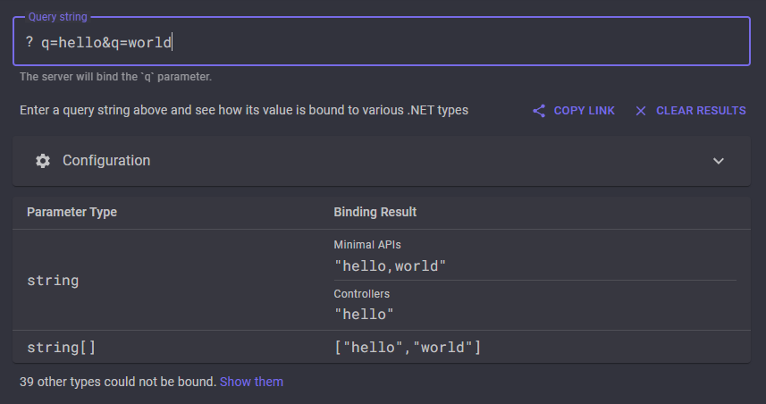

# .NET Query String Detective

> ⚠️ Under Construction

An online tool to quickly and effortlessly test and compare the behaviour of .NET's query string binding across both minimal APIs and controller-based APIs[^1].

## How does it work?

Input queries are sent to a set of in-memory test server ([TestServer](https://learn.microsoft.com/en-us/dotnet/api/microsoft.aspnetcore.testhost.testserver?view=aspnetcore-8.0)) instances &mdash; a component which fuels .NET's integration testing capabilities[^2] &mdash; one which wraps an API built with minimal APIs, and another which wraps an API built with Controllers.

Using source generators[^3], these test servers define a number of endpoints which utilise the [FromQuery](https://learn.microsoft.com/en-us/dotnet/api/microsoft.aspnetcore.mvc.fromqueryattribute?view=aspnetcore-8.0) attribute to bind (or, attempt to bind) the incoming query string parameter `q` to a given target type.

A distinct (in-memory) request is sent to each test server for all target types, and these binding results are collated by the caller and returned to the client. To summarize:

[^1]: [Choose between controller-based APIs and minimal APIs | Microsoft Learn](https://learn.microsoft.com/en-us/aspnet/core/fundamentals/apis?view=aspnetcore-8.0)

[^2]: [Integration tests in ASP.NET Core | Microsoft Learn](https://learn.microsoft.com/en-us/aspnet/core/test/integration-tests?view=aspnetcore-8.0)

[^3]: [Source Generators | Microsoft Learn](https://learn.microsoft.com/en-us/dotnet/csharp/roslyn-sdk/source-generators-overview)
